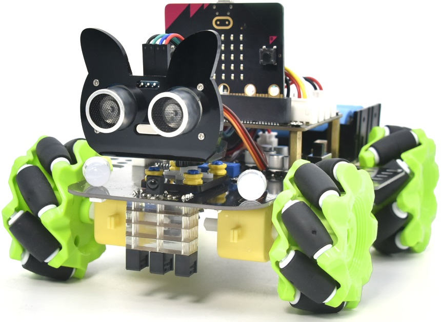

<!-- new_lines: 5 -->
Firmware Intermediate: Rust + rc car. What could go wrong?
===

<!-- end_slide -->

<!-- new_lines: 5 -->
What is this about?
===

<!-- new_lines: 5 -->
# Why?
# The poor thing

<!-- end_slide -->

<!-- new_lines: 5 -->
The car in depth
===

<!-- column_layout: [1, 1] -->

<!-- column: 0 -->
<!-- new_lines: 5 -->
## 🧠 The brain
- (https://microbit.org/)

<!-- column: 1 -->
<!-- new_lines: 5 -->
## 🚗 The body
- (https://www.keyestudio.com/products/keyestudio-micro-bit-4wd-mecanum-robot-car-v20-diy-smart-kit-with-microbit-board)

<!-- end_slide -->

<!-- new_lines: 5 -->
Ok, I'm in. But how?
===

<!-- new_lines: 5 -->
### Hacking through the kids documentation
- Car Documentation and kids tutorial:(https://docs.keyestudio.com/projects/KS4034/en/latest/docs/index.html#product-introduction)
- Microbit schematics:(https://tech.microbit.org/hardware/schematic/)
### 🦀 Rust and embassy
- Embassy:(https://embassy.dev/)
- Examples(the important bit): (https://github.com/embassy-rs/embassy/tree/main/examples/nrf52840)
### 🤖 AI
- The new rubber duck

<!-- end_slide -->

<!-- new_lines: 5 -->
Finally. The code!🎉
===

<!-- new_lines: 5 -->
#### Github repo:
- (https://github.com/MonforteAdrian/RcCar)

<!-- end_slide -->

<!-- new_lines: 5 -->
But you haven't finished!? What’s Next?
===

<!-- column_layout: [1, 1] -->

<!-- column: 0 -->
<!-- new_lines: 5 -->
##### The car
- The todo comments in main.rs

<!-- column: 1 -->
<!-- new_lines: 5 -->
##### The brain
- Tons of online documentation for microbit for a lot of languages.
- Oficial page:(https://microbit.org/projects/make-it-code-it/)

<!-- end_slide -->

<!-- new_lines: 5 -->
🏁Thank you!
===

<!-- new_lines: 5 -->
###### Demo and QA!
